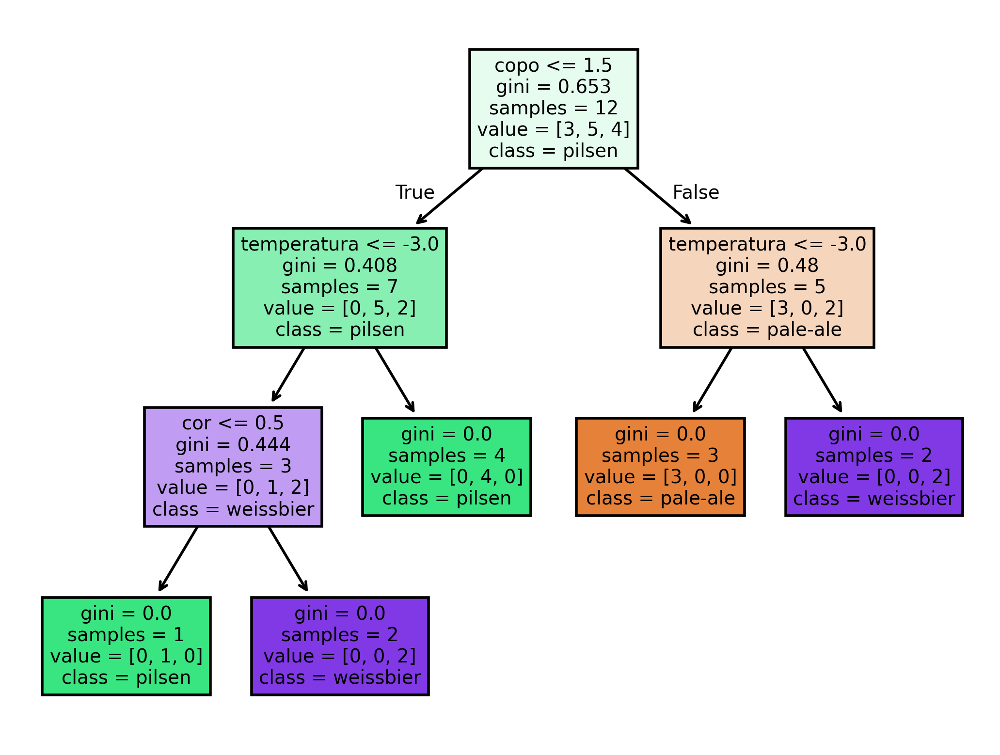

# Scikit Learn
## Quem é:
- Principal biblioteca do python que usamos para Machine Learning

---

## Decision Tree Classifier
### O que é:
- É um modelo de árvore de decisão que foi mencionado no markdown da introdução
### Regras:
- Todas as colunas das features devem ter dados numéricos ou que possam ser convertidos para numéricos
- Padronize características de forma numérica para que seu modelo possa ser treinado(variáveis dummys)

### Árvore feita seguindo essas regras:
