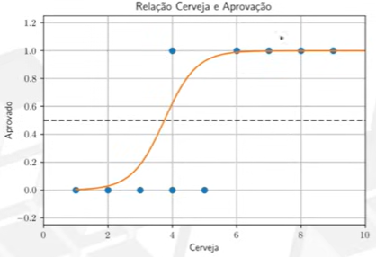

# Aprendizado Supervisionado - Classificação
Usado quando não temos um valor explicito que queremos prever, mas sim categorias. 

Ex.: Passou e reprovou. Viveu e morreu.

## Regressão Logística:
Regressão que fazemos para a classificação, onde não faz sentido traçarmos uma linearidade.

Ex.: 

* **Cálculo**: 
$$
y = \frac{1}{1 + e^{-(\beta_0 + \beta_1 x_1)}}
$$

* Log Loss(Calcula a perda):
$$
L_{\log}(y, p) = -\big(y \log(p) + (1 - y)\log(1 - p)\big)
$$
- Para o conjunto todo:
$$
\sum_{i=1}^{n} L_{\log}(y_i, p_i) = -\sum_{i=1}^{n} \left( y_i \log(p_i) + (1 - y_i)\log(1 - p_i) \right)
$$

## Índice de Gini:
Índice que calcula a pureza de um nó da árvore.

Vai de 0 a 1, onde 0 é um nó puro e 1 é um nó completamente desigual