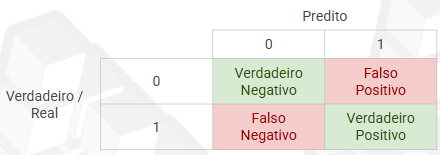

# Métricas de ajuste para regressão
Representações gráficas, às vezes, podem ser mal interpretadas por diversos motivos, assim, é bom haver métricas que interpretem o que foi gerado. A ideia é haver um quantitativo que represente o quanto nosso algoritmo aprendeu.
- Matriz de confusão: 
- **Acurácia**: Quem do meu predito realmente está correto $$ \frac{VN + VP} {VN + FN + VP + FP}$$
- **Precisão**: Quantos % dos positivos realmente são positivos $$\frac{VP}{VP + FP}$$
- **Recall ou Sensibilidade**: Quantos % do positivos eu consegui acertar $$\frac{VP}{VP + FN}$$
- **Especificidade**: Quantos % dos negativos eu consegui acertar$$\frac{VN}{VN + FP}$$
- **Área sob a Curva ROC(AUC)**: Sensibilidade(Recall) x Especificidade: A AUC-ROC mede o quão bem o modelo consegue separar positivos de negativos, independentemente do limiar escolhido.