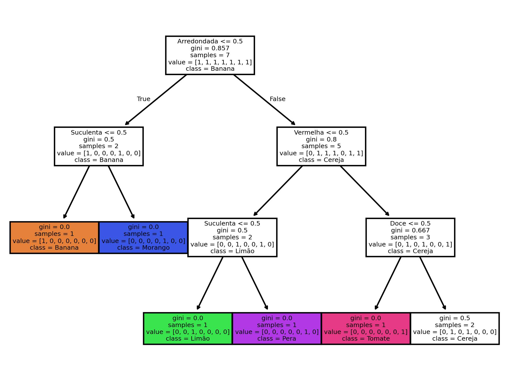

# Machine Learning com o Téo
## Definições:
- Ajudar a máquina a aprender o que é cada coisa através de suas características
- Como falar pra uma máquina: "Se é uma fruta, é redonda, vermelha, suculenta e dá em árvore, então é uma maçã"
- Podemos fazer isso de algumas maneiras, mas o cerne da questão é diferenciar uma coisa da outra por suas características para que ela saiba o que é o que
- Outra coisa importante, de começo a máquina é como uma criança que acabou de nascer e não conhece o mundo, então, não podemos esperar que ela me fale que algo é uma melancia se ela nem conhecer o que é uma melancia
## Árvore de Decisão:
- Uma das formas
- Dividindo as classes por suas características até chegar em um "nó puro", um nó que possui apenas membros de uma única classe
- Um monte de if's um atrás do outro que vai diferenciar uma coisa da outra

## Primeira árvore de decisão

---

## Overfitting
### O que é:
- Acontece quando ajustamos um modelo de uma maneira muito específica de modo a "caber" apenas em um grupo específico de dados
### Por quê evitar?
- Evita-se pois normalmente não criamos o modelo para apenas um grupo de dados, mas para que ele seja reutilizável
### Analogia
- Pense que o modelo é uma camisa, quando vamos criar um modelo, criamos um modelo que é de um tamanho da camisa, como P, M ou G. O que não podemos no modelo é criar uma camisa que vai servir apenas para pessoa X ou Y, pois esse modelo não vai conseguir ser vendido, já que foi feito sob medida para alguém.